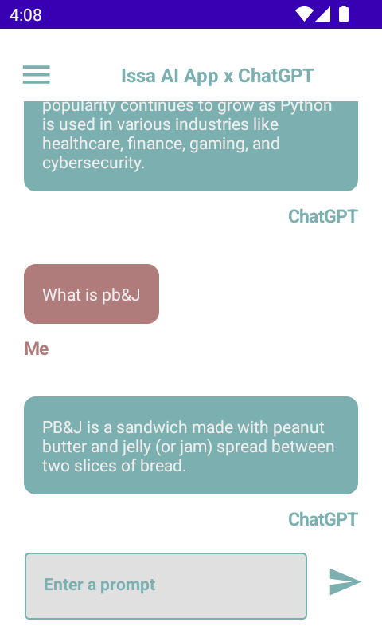
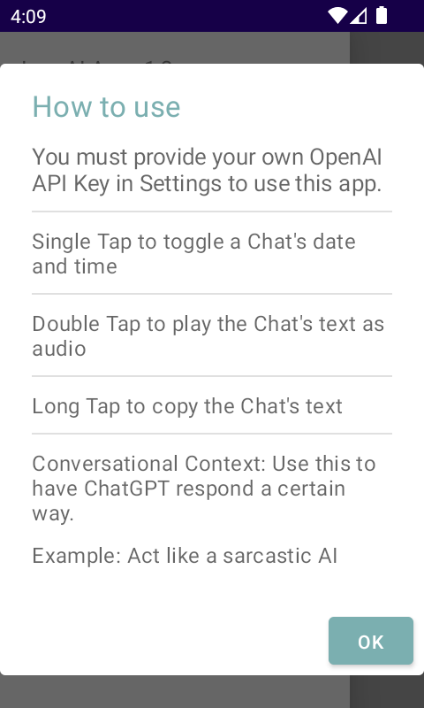

<div align="center">
  
  <br><br>
</div>

[](https://github.com/BrianJr03/Issa-Chat-App/releases/latest)

# Issa Chat App

<div align="center">
<a href='https://github.com/BrianJr03/Issa-Chat-App/releases/latest'></a>
</div>

## About the Project

This App is a simple chat app that uses OpenAI's GPT-3 API to generate responses.  
Additionally there are many other features that make this app unique.  
Find out more below.

<div align="center">


</div>

## Features

- Chat with ChatGPT
  - Only an OpenAI API Key is needed to chat with ChatGPT (`gpt-3.5-turbo`)
  - Add `Conversational Context` to personalize responses from ChatGPT
    - Example: "You are my sarcastic assistant"

- Chat taps

  - Single tap to `toggle` a Chat's date and time

  - Double tap to `play` a Chat's text as audio
  
  - Long press to `copy` a Chat's text
  
- Dark / Light mode

  - Based on your system settings, this app supports both dark and light mode
  
- Persistent Chat - Chats will be saved automatically

- Theme Dialog - Select between 3 themes in `Theme`  
  
- Settings Dialog

  - You can do a few things in `Settings`
    - Add & Update API Key
    - Remove all chats
    - Toggle `Auto-play`, which allows one to automatically play an incoming Chat's text
    - Toggle a random `Conversational Context` being set on app start

## Prerequisites

- [Android Studio](https://developer.android.com/studio)
- Android SDK
- OpenAI API Key can be found at <https://platform.openai.com/account/api-keys>

## Installation

Feel free to download the latest release from one of the sources above.  
If you want to build it yourself, follow the steps below.

1. Clone the repo

   ```sh
   git clone https://github.com/BrianJr03/Issa-Chat-App.git
   ```

2. Open in Android Studio
3. Run on emulator or device

## Tech Stack

- Kotlin
- Jetpack Compose
- MVVM with Repository
- Coroutines
- RoomDB
- DaggerHilt
